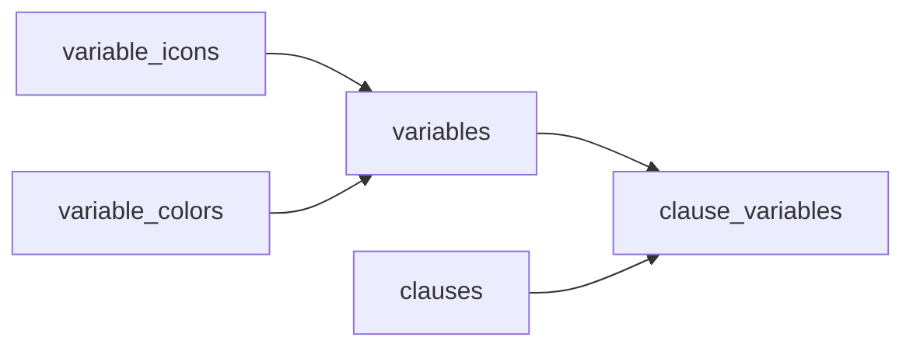
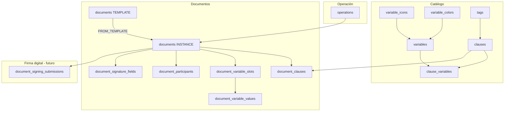

<p align="center">
  <a href="http://nestjs.com/" target="blank"></a>
</p>

<p align="center">A progressive <a href="http://nodejs.org" target="_blank">Node.js</a> framework for building efficient and scalable server-side applications.</p>

# RG Asesores API

API interna de **RG Asesores** para gestionar variables, cláusulas y documentos firmables, agrupados en operaciones de negocio, con generación de PDF y envío futuro a una plataforma de firma digital (proveedor aún por definir).

| Capa | Tecnología |
|------|------------|
| Backend | [NestJS](https://nestjs.com) |
| API | GraphQL (`/graphql`) |
| ORM | TypeORM |
| Base de datos | PostgreSQL 16 |
| Autenticación | JWT |

---

## Propósito de la aplicación

Plataforma **interna** para RG Asesores que centraliza:

1. **Biblioteca de variables** reutilizables (tipos, validaciones, iconos y colores) para componer cláusulas.
2. **Biblioteca de cláusulas** que referencian variables del catálogo; las cláusulas componen documentos de tipo contrato.
3. **Documentos** no limitados a contratos: cualquier expediente que deba firmarse por participantes (`document_type`: `CONTRACT` u `OTHER`).
4. **Operaciones** que agrupan documentos ligados (contrato inicial, renovaciones, anexos, etc.).
5. **Generación de contratos/PDF** a partir de cláusulas y valores capturados (`content_source = COMPOSED`).
6. **Subida de archivos** para documentos no compuestos (`content_source = UPLOADED`) y envío a firma.
7. **Módulo de firma digital** agnóstico al proveedor (`document_signing_submissions`, espacios de firma, estados por participante); la integración concreta se implementará cuando se elija la plataforma.

El objetivo es eliminar el flujo manual fragmentado (Word/PDF, mensajería informal, carga repetida en herramientas externas) y ofrecer un ciclo guiado: catálogo → composición → captura de variables → participantes → PDF → envío a firma → seguimiento.

---

## Estructura del proyecto

```
rg-asesores-api/
├── docker-compose.yml      # PostgreSQL (+ servicio api opcional)
├── .env                    # Variables de entorno (no commitear secretos)
├── src/
│   ├── main.ts             # Bootstrap; GraphQL en /graphql
│   ├── app.module.ts       # Config, TypeORM, módulos de dominio
│   ├── auth/               # Login, JWT, tokens, guards
│   ├── users/              # Usuarios internos (roles)
│   ├── variables/          # Catálogo de variables
│   │   ├── variable-icons/
│   │   └── variable-colors/
│   ├── clauses/            # Biblioteca de cláusulas
│   ├── tags/               # Etiquetas de cláusulas
│   ├── health/             # Health check
│   └── common/
│       ├── availability/   # Enum, flujo de transiciones
│       ├── deletability/   # isDeletable y reglas de borrado
│       ├── identifier/     # Generación PREFIX-0001
│       ├── pagination/
│       ├── filter-sort/
│       ├── mail/           # Resend + plantillas Handlebars
│       └── response/       # Respuestas GraphQL unificadas
└── test/
```

Módulos de dominio aún no expuestos en código (definidos en `schema.dbml`): `operations`, `documents`, `signers`, integración `signing_platform`.

---

## Gestor de variables

El **catálogo central de variables** es reutilizable e independiente de una cláusula o documento concreto. Cada entrada define tipo, reglas de validación, presentación (icono/color) y valor por defecto. Las cláusulas **solo referencian** variables del catálogo; **no redefinen** tipo ni validaciones.

| Tabla | Rol |
|-------|-----|
| `variables` | Definición: `key`, `data_type`, `data_format`, `type_options`, `default_value`, `value_scope` |
| `variable_icons` / `variable_colors` | Presentación en el gestor |
| `clause_variables` | Uso en cláusula: `key_required`, `party_role`, `key_if_empty`, `value_scope` |
| `document_variable_slots` / `document_variable_values` | Captura al llenar un documento `CONTRACT` |

- Cada variable tiene `key` en `snake_case` único; en el texto de la cláusula se usa como placeholder `{{key}}`.
- La **obligatoriedad** al llenar un documento se define en la cláusula (`clause_variables.key_required`), no en el catálogo.
- Si la misma variable aparece en varias cláusulas, tipo y reglas deben ser **idénticos** (una sola fila en `variables`).
- `value_scope`: `DOCUMENT` (un valor por expediente) o `PARTICIPANT` (un valor por participante según `party_role`).



### Combinaciones válidas (`data_type` + `is_array`)

| data_type | is_array | Uso |
|-----------|----------|-----|
| `TEXT` | `false` | Texto libre, email o teléfono (`data_format`) |
| `BOOLEAN` | `false` | Sí / no |
| `NUMBER` | `false` | Número, moneda o % (`data_format`: `NUMBER`, `CURRENCY`, `PERCENT`) |
| `NUMBER` | `true` | Lista de números |
| `DATE` | `false` | Fecha (`DATE`) o fecha y hora (`DATETIME`) |
| `ENUM` | `false` | Select (una opción) |
| `ENUM` | `true` | Multi-select / chips |

No válido: `TEXT`, `BOOLEAN` o `DATE` con `is_array = true`.

### `data_type` + `data_format`

`data_format` complementa a `data_type` (no lo sustituye). Solo son válidos estos pares:

| data_type | data_format |
|-----------|-------------|
| `TEXT` | `TEXT`, `EMAIL`, `PHONE` |
| `BOOLEAN` | `BOOLEAN` |
| `NUMBER` | `NUMBER`, `CURRENCY`, `PERCENT` |
| `DATE` | `DATE`, `DATETIME` |
| `ENUM` | `SELECT`, `CHIPS` |

### `type_options` (esquema estándar)

Objeto JSON en `variables.type_options`. Incluir solo las secciones que aplican:

| Sección | Contenido |
|---------|-----------|
| `string` | `min_length`, `max_length`, `pattern` |
| `number` | `min`, `max`, `decimal_places`, `allow_negative`, `currency_code` (si `CURRENCY`) |
| `boolean` | `false_label`, `true_label` (texto para No/Sí en UI y PDF) |
| `items` | `min_count`, `max_count`; subobjeto `number` para `NUMBER[]`; **`enum_values`** `[{ value, label, sort }]` para `ENUM` |
| `date` | `min` / `max` con `kind`: `none`, `fixed`, `today`, `offset`; `timezone` si `DATETIME` |
| `messages` | Errores o hints: `string.pattern`, `number.min`, `date.max`, etc. |

**BOOLEAN** — etiquetas personalizadas:

```json
{
  "boolean": {
    "false_label": "No incluye mantenimiento",
    "true_label": "Sí incluye mantenimiento"
  },
  "messages": {
    "boolean.false_label": "Etiqueta cuando el valor es falso",
    "boolean.true_label": "Etiqueta cuando el valor es verdadero"
  }
}
```

**DATE** — límites en `date.min` / `date.max`:

| `kind` | Descripción |
|--------|-------------|
| `none` | Sin límite en ese extremo |
| `fixed` | Fecha fija: `"YYYY-MM-DD"` o ISO 8601 con hora si `DATETIME` |
| `today` | Fecha actual (timezone de negocio, ej. `America/Mexico_City`) |
| `offset` | `offset_days`: límite = hoy + N días |

```json
{
  "date": {
    "min": { "kind": "today" },
    "max": { "kind": "offset", "offset_days": 30 },
    "timezone": "America/Mexico_City"
  },
  "messages": {
    "date.min": "La fecha no puede ser anterior a hoy",
    "date.max": "La fecha no puede ser posterior a 30 días"
  }
}
```

**ENUM** — valores permitidos en `type_options.items.enum_values` (no en tabla aparte). Con `is_array=true`, usar `items.min_count` / `max_count`.

### `default_value` por tipo

Columna `variables.default_value` (jsonb). `null` = sin valor inicial.

| data_type | is_array | Formato `default_value` |
|-----------|----------|-------------------------|
| `TEXT` | false | `"Juan Pérez"` |
| `BOOLEAN` | false | `true` o `false` |
| `NUMBER` | false | `1500.5` |
| `NUMBER` | true | `[100, 200, 350.5]` |
| `DATE` | false | `DATE`: `"2026-05-19"` o `{ "kind": "today" }` · `DATETIME`: `"2026-05-19T10:00:00-06:00"` o `{ "kind": "now" }` |
| `ENUM` | false | `"12"` (debe existir en `items.enum_values[].value`) |
| `ENUM` | true | `["agua", "luz"]` |

Los valores relativos `today` / `now` se resuelven al **mostrar** el formulario del documento, no se persisten como fecha fija en el catálogo.

Para activar una variable (`availability → ACTIVE`), la API valida que `default_value` y `type_options` sean coherentes con `data_type`, `data_format` e `is_array`.

### Valores en documento (`document_variable_values`)

- `value`: mismo formato JSON que `default_value` del tipo correspondiente.
- Al renderizar PDF, si no hay valor y `key_required=false`, aplica `key_if_empty` de `clause_variables`.

**Obligatoriedad en documento:** si la variable aparece en varias cláusulas, es obligatoria si **cualquiera** tiene `key_required = true` (OR lógico); el slot refleja `is_required` agregado.

### Ejemplos de variables

**RFC (TEXT + pattern)**

```json
{
  "key": "rfc_cliente",
  "label": "RFC del cliente",
  "data_type": "TEXT",
  "data_format": "TEXT",
  "type_options": {
    "string": { "max_length": 13, "pattern": "^[A-ZÑ&]{3,4}\\d{6}[A-Z0-9]{3}$" },
    "messages": { "string.pattern": "RFC inválido" }
  },
  "default_value": null
}
```

**Monto MXN (NUMBER + CURRENCY)**

```json
{
  "key": "monto_arrendamiento",
  "label": "Monto de arrendamiento",
  "data_type": "NUMBER",
  "data_format": "CURRENCY",
  "type_options": {
    "number": { "min": 0, "decimal_places": 2, "currency_code": "MXN" }
  },
  "default_value": null
}
```

**Plazo (ENUM select)**

```json
{
  "key": "plazo_meses",
  "data_type": "ENUM",
  "data_format": "SELECT",
  "is_array": false,
  "type_options": {
    "items": {
      "enum_values": [
        { "value": "12", "label": "12 meses", "sort": 1 },
        { "value": "24", "label": "24 meses", "sort": 2 }
      ]
    }
  },
  "default_value": "12"
}
```

**Servicios incluidos (ENUM multi-select)**

```json
{
  "key": "servicios_incluidos",
  "data_type": "ENUM",
  "data_format": "CHIPS",
  "is_array": true,
  "type_options": {
    "items": {
      "min_count": 1,
      "max_count": 5,
      "enum_values": [
        { "value": "agua", "label": "Agua", "sort": 1 },
        { "value": "luz", "label": "Luz", "sort": 2 }
      ]
    }
  },
  "default_value": ["agua", "luz"]
}
```

**Fecha de firma = hoy, sin fechas pasadas (DATE)**

```json
{
  "key": "fecha_firma",
  "data_type": "DATE",
  "data_format": "DATE",
  "type_options": {
    "date": { "min": { "kind": "today" }, "max": { "kind": "none" } }
  },
  "default_value": { "kind": "today" }
}
```

---

## Identificadores legibles

Cada entidad principal lleva un `identifier` único generado por `IdentifierService` con formato `{PREFIJO}-{secuencia}` (secuencia de 4 dígitos por defecto).

| Entidad | Prefijo | Ejemplo |
|---------|---------|---------|
| Usuario | `USRIO-` | `USRIO-0001` |
| Icono de variable | `ICON-` | `ICON-0001` |
| Color de variable | `CLR-` | `CLR-0001` |
| Variable | `VAR-` | `VAR-0001` |
| Cláusula | `CLS-` | `CLS-0001` |
| Etiqueta | `TAG-` | `TAG-0001` |
| Firmante (catálogo) | `SGN-` | `SGN-0001` |
| Operación | `OPR-` | `OPR-0001` |
| Documento plantilla | `TMP-` | `TMP-0001` |
| Documento instancia | `DOC-` | `DOC-0001` |

En documentos, el prefijo depende de `record_type`: `TEMPLATE` → `TMP-`, `INSTANCE` → `DOC-`.

---

## Availability (ciclo de vida de registros)

Enum compartido: `ACTIVE`, `INACTIVE`, `ARCHIVED`, `DRAFT`, `DELETED`.

Las transiciones válidas se controlan con `AvailabilityFlowService` y acciones semánticas:

| Acción | Desde | Hacia |
|--------|-------|-------|
| `ACTIVATE` | `DRAFT`, `INACTIVE`, `ARCHIVED` | `ACTIVE` |
| `DEACTIVATE` | `ACTIVE` | `INACTIVE` |
| `ARCHIVE` | `INACTIVE` | `ARCHIVED` |
| `DELETE` | `ARCHIVED` | `DELETED` |

En GraphQL, cada entidad expone:

- `availableActions`: acciones permitidas desde el estado actual.
- Mutación `change*Availability(id, availability)`: solo acepta transiciones **directas** válidas (equivalente a una acción del mapa anterior).

**Estados iniciales típicos al crear:**

| Entidad | `availability` inicial |
|---------|------------------------|
| Variable | `DRAFT` (debe activarse para usarse en producción) |
| Icono / color | `ACTIVE` |
| Cláusula / tag | `ACTIVE` |
| Usuario | `INACTIVE` (tras registro) |

---

## Borrado físico (`delete`) e `isDeletable`

El borrado **no** es inmediato al archivar: es un paso aparte después de `DELETED`.

1. **`isDeletable`** (campo GraphQL en la entidad): indica si **no hay referencias** que bloqueen el borrado (`DeletabilityService`).
2. **`delete`**: solo permitido si:
   - `availability === DELETED`, **y**
   - `isDeletable === true` (se valida con `assertDeletable`).

| Entidad | No es eliminable si… |
|---------|----------------------|
| `TAG` | Está asignada a cláusulas (`clause_tags`) |
| `CLAUSE` | Otra cláusula la referencia en `replaces_clause_id` |
| `VARIABLE` | Aparece en `clause_variables` |
| `VARIABLE_ICON` | La usan variables |
| `VARIABLE_COLOR` | La usan variables |
| `USER` | Creó cláusulas (`created_by`) |

Flujo recomendado en UI: desactivar → archivar → eliminar lógico (`DELETED`) → confirmar borrado físico solo si `isDeletable` es verdadero.

---

## Variables de entorno

Copiar y ajustar `.env` en la raíz de `rg-asesores-api`:

```env
# Servidor
NODE_ENV=development
PORT=3000

# PostgreSQL (host local con Docker: puerto publicado 5433)
DB_HOST=localhost
DB_PORT=5433
DB_USERNAME=rguser
DB_PASSWORD=rgpassword
DB_NAME=rg_contracts
DB_SYNCHRONIZE=true    # true solo en desarrollo; usar migraciones en producción
DB_LOGGING=true
DB_SSL=true

# JWT
JWT_SECRET=cambiar-en-produccion
JWT_EXPIRES_IN=7d

# URLs para enlaces en correos
APP_URL=http://localhost:3000

# Correo (Resend)
RESEND_API_KEY=
RESEND_FROM=
```

| Variable | Uso |
|----------|-----|
| `DB_*` | Conexión TypeORM a PostgreSQL |
| `DB_SYNCHRONIZE` | Sincroniza esquema desde entidades (desarrollo) |
| `JWT_SECRET` / `JWT_EXPIRES_IN` | Sesiones GraphQL |
| `APP_URL` | Links de verificación y reset de contraseña |
| `RESEND_*` | Envío de correos transaccionales |

---

## Levantar el proyecto

### 1. Base de datos con Docker

Desde `rg-asesores-api/`:

```bash
docker compose up -d postgres
```

PostgreSQL queda en `localhost:5433` (mapeo por defecto del compose). El servicio `api` del compose es opcional; en desarrollo suele ejecutarse la API en el host.

### 2. Instalar dependencias y conectar la API

```bash
npm install
cp .env.example .env   # si existe; si no, usar la tabla anterior
npm run start:dev
```

GraphQL Playground: `http://localhost:3000/graphql`

### 3. Orden recomendado en desarrollo

1. Levantar **solo** `postgres` con Docker.
2. Configurar `.env` con `DB_HOST=localhost` y `DB_PORT=5433`.
3. Arrancar la API (`npm run start:dev`); TypeORM crea/actualiza tablas si `DB_SYNCHRONIZE=true`.
4. Sembrar admin inicial vía mutación `seedAdmin` (módulo `auth`) si aplica.

---

## Flujo de creación (según DBML)



### Paso a paso

1. **Catálogo base:** iconos y colores (`ACTIVE`).
2. **Variables:** crear en `DRAFT`, completar `data_type`, `data_format`, `type_options`, `default_value`; pasar a `ACTIVE` cuando estén listas.
3. **Cláusulas:** redactar `body_text` con placeholders `{{key}}`; enlazar variables en `clause_variables` (`key_required`, `party_role`, `key_if_empty`).
4. **Operación (opcional):** `operations` agrupa expedientes relacionados.
5. **Plantilla (`documents`, `record_type=TEMPLATE`):** composición de cláusulas, participantes, slots y valores por defecto.
6. **Instancia (`record_type=INSTANCE`):**
   - `creation_mode=EMPTY` — expediente vacío.
   - `FROM_TEMPLATE` — copia desde plantilla (`source_template_id`).
   - `FROM_UPLOAD` — archivo en bucket (típico para `document_type=OTHER`).
7. **Captura:** `document_variable_values` por slot; validar contra definición de variable.
8. **PDF:** `file_bucket` con PDF generado (`COMPOSED`) o archivo subido (`UPLOADED`).
9. **Firma:** espacios en `document_signature_fields`; envío y seguimiento en tablas `document_signing_submissions` / `document_participant_signing_status` (integración pendiente de proveedor).

**Regla clave:** `content_source=COMPOSED` solo si `document_type=CONTRACT`. Cualquier otro tipo firmable usa `UPLOADED`.

---

## Módulos GraphQL implementados

| Módulo | Operaciones principales |
|--------|-------------------------|
| `auth` | Login, registro, verificación email, reset/cambio contraseña |
| `users` | CRUD, `changeUserAvailability`, `isDeletable`, `deleteUser` |
| `variables` | CRUD, activación (valida tipo), availability, delete |
| `variable-icons` / `variable-colors` | CRUD, availability, delete |
| `clauses` | CRUD, availability, delete |
| `tags` | CRUD, availability, delete |
| `health` | Estado del servicio |

---

## Scripts npm

```bash
npm run start:dev    # Desarrollo con watch
npm run build        # Compilar
npm run start:prod   # Producción (dist/)
npm run test         # Unit tests
npm run test:e2e     # E2E
npm run lint         # ESLint
```

---

## Documentación relacionada

| Documento | Contenido |
|-----------|-----------|
| [`../readme.md`](../readme.md) | Misma documentación (vista desde la raíz del monorepo) |
| [`../schema.dbml`](../schema.dbml) | Esquema PostgreSQL de referencia (variables, cláusulas, documentos) |

---

*API interna RG Asesores — uso exclusivo del equipo.*
